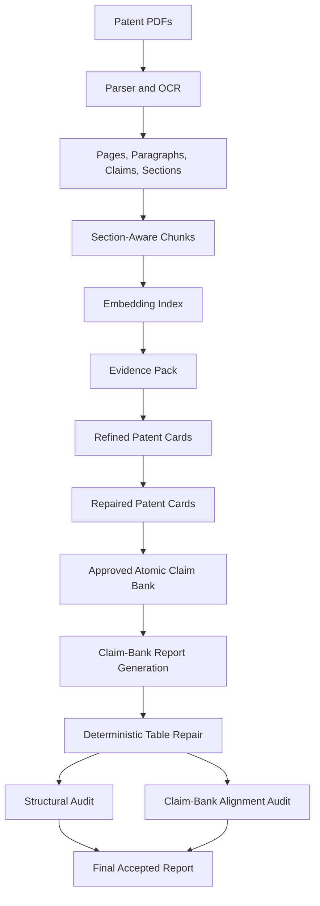

# PatentLLM: Claim-Grounded Patent Report Generation from Patent PDFs

PatentLLM is an experimental RAG pipeline for generating R&D-focused patent intelligence reports from patent PDFs. The project focuses on a specific technical problem: **how to generate patent reports that are not only readable, but also traceable to patent evidence**.

The final system does not rely on direct chunk-to-report generation. Early experiments showed that standard RAG could produce well-structured reports while still attaching citations to claims that were too broad or weakly supported. The accepted architecture therefore uses an intermediate grounding layer: **refined patent cards → repaired patent cards → approved atomic claim bank → deterministic high-risk tables**.

## Final Result

| Item                                  |                                             Result |
| ------------------------------------- | -------------------------------------------------: |
| Patent publications analyzed          |                                                 10 |
| Owners represented                    |                                     Henkel, Bostik |
| Priority window                       |                                          2009–2021 |
| Final report architecture             |                  Claim-bank + deterministic tables |
| Final report citations                |                                                102 |
| Body citations before patent key      |                                                 76 |
| Invalid citations                     |                                                  0 |
| Citation-spam rows after table repair |                                                  0 |
| Claim-bank alignment                  |            55/55 rows aligned or partially aligned |
| Final accepted report                 | `docs/results/final_claim_bank_grounded_report.md` |

## Dataset

The project uses 10 hot-melt adhesive patent publications:

| Patent      | Owner  | Priority year | Main technical signal                                         |
| ----------- | ------ | ------------: | ------------------------------------------------------------- |
| EP2756049A1 | Henkel |          2011 | Propylene homopolymer hot-melt adhesive                       |
| EP2841522A1 | Henkel |          2012 | Polar-functional polymer and polyester-compatible formulation |
| EP2411423A1 | Henkel |          2009 | Viscosity-reduced polymer blend adhesive                      |
| EP2958970A1 | Henkel |          2013 | Elastic attachment hot-melt adhesive                          |
| EP2686395A2 | Henkel |          2010 | Ethylene copolymer and modified wax formulation               |
| EP3268442A1 | Henkel |          2015 | Stretch-laminate adhesive with bleed-through control          |
| EP2456819A1 | Bostik |          2009 | Olefin block copolymer adhesive                               |
| EP3402857A1 | Bostik |          2016 | SSC-PP polymer blend adhesive                                 |
| EP3707219A1 | Bostik |          2017 | LMW/HMW propylene-based polymer blend                         |
| EP4441161A1 | Bostik |          2021 | Metallocene-catalyzed propylene-based copolymer system        |

The target report is an R&D technology-intelligence report covering ownership, temporal trends, polymer routes, formulation strategies, application focus, and R&D implications.

## Architecture



## Design Decisions

| Component                        | Choice                                 | Reason                                                                                                                                            |
| -------------------------------- | -------------------------------------- | ------------------------------------------------------------------------------------------------------------------------------------------------- |
| Parser                           | Section-aware parser with OCR fallback | Patent sections have different analytical value; claims, examples, descriptions, and metadata should not be treated as one flat text stream.      |
| Chunking                         | Mixed chunk types                      | Whole claims, paragraph windows, evidence windows, and parent-section windows preserve more patent meaning than one fixed-size splitter.          |
| Embedding baseline               | `BAAI/bge-m3`                          | Used as the main retrieval index because it handles long, technical, multilingual-style text better than many small generic embedding models.     |
| Patent-domain embedding baseline | `AI-Growth-Lab/PatentSBERTa`           | Indexed as a patent-specialized comparison model because patent similarity and claim-level retrieval can benefit from domain-specific embeddings. |
| Vector store                     | Chroma                                 | Chosen for local persistence, fast iteration, no cloud dependency, and simple metadata filtering.                                                 |
| LLM backend                      | Ollama local models                    | Used to avoid paid APIs, keep data local, and compare open-source models under controlled conditions.                                             |
| Final model                      | `qwen3:8b`                             | Selected for the final accepted report because it produced the best usable technical report after grounding and deterministic repair.             |
| Final grounding layer            | Atomic claim bank                      | Added because valid evidence IDs alone did not guarantee citation support.                                                                        |
| Deterministic table repair       | Used for high-risk tables              | Tables were the main source of broad multi-citation claims, so final tables were generated from approved claim-bank items.                        |

## Parsing Evaluation

| Metric                    | Result |
| ------------------------- | -----: |
| Documents parsed          |     10 |
| Pages extracted           |    389 |
| Paragraphs extracted      |  8,291 |
| Chunks created            |    558 |
| Parser warnings           |      8 |
| Missing claims            |      0 |
| Missing abstract detected |      1 |

The parser output is stored in:

```text
data/processed/parsed_patents/
```

Key files:

```text
documents.jsonl
pages.jsonl
paragraphs.jsonl
chunks.jsonl
quality_report.jsonl
```

## Chunking and Evidence Strategy

The project does not use only one chunk size because patents distribute information unevenly.

| Patent element | Why it matters                                      | Representation used                        |
| -------------- | --------------------------------------------------- | ------------------------------------------ |
| Claims         | Defines the core claimed technical subject matter   | Claim chunks and claim-clause windows      |
| Description    | Contains implementation detail and embodiments      | Paragraph and section windows              |
| Examples       | Often contains formulation and performance evidence | Evidence paragraph windows                 |
| Metadata       | Supports ownership, dates, and patent identity      | Metadata records, not primary RAG evidence |
| Title/abstract | Useful for high-level technology signal             | Used cautiously, not as sole evidence      |

The evidence pack deliberately excludes noisy or weak evidence categories from primary report grounding, especially metadata-heavy and search-report-like chunks.

## Embedding and Indexing

Two indexes were built:

| Collection                   | Model                        | Purpose                                             |
| ---------------------------- | ---------------------------- | --------------------------------------------------- |
| `patent_chunks_bge_m3`       | `BAAI/bge-m3`                | Main retrieval index for evidence-pack construction |
| `patent_chunks_patentsberta` | `AI-Growth-Lab/PatentSBERTa` | Patent-domain embedding comparison baseline         |

Build commands:

```powershell
python scripts/build_index.py `
  --chunks-path data/processed/parsed_patents/chunks.jsonl `
  --persist-dir data/processed/vector_store/chroma `
  --collection-name patent_chunks_bge_m3 `
  --embedding-backend sentence_transformer `
  --model-name BAAI/bge-m3 `
  --batch-size 8
```

```powershell
python scripts/build_index.py `
  --chunks-path data/processed/parsed_patents/chunks.jsonl `
  --persist-dir data/processed/vector_store/chroma `
  --collection-name patent_chunks_patentsberta `
  --embedding-backend sentence_transformer `
  --model-name AI-Growth-Lab/PatentSBERTa `
  --batch-size 16
```

## LLMs Compared

| Model         | Role in experiment          | Observed strength                                   | Observed limitation                                                      |
| ------------- | --------------------------- | --------------------------------------------------- | ------------------------------------------------------------------------ |
| `qwen3:8b`    | Final accepted report model | Best usable technical output after grounding layers | Slower than Llama; still required claim-bank grounding and table repair  |
| `llama3.1:8b` | Fast baseline               | Strong structure and speed                          | Earlier report versions showed weak body-citation behavior               |
| `mistral:7b`  | Compact baseline            | Fast and lightweight                                | More prompt leakage and weaker semantic reliability in report generation |

The final report was generated with:

```text
ollama:qwen3:8b
```

## Report Generation Evolution

| Stage                             | Input to LLM                                     | Main result                                          | Main failure                                         | Decision               |
| --------------------------------- | ------------------------------------------------ | ---------------------------------------------------- | ---------------------------------------------------- | ---------------------- |
| Raw evidence-pack report          | Retrieved chunks                                 | Produced complete report structure                   | Weak citation support and broad claims               | Not accepted           |
| Card-based report                 | Refined patent cards                             | Improved patent-level organization                   | Still allowed evidence blending                      | Not accepted           |
| Claim-bank report                 | Approved atomic claims                           | Better grounding and less citation freedom           | Tables still created broad multi-citation rows       | Improved but not final |
| Claim-bank + deterministic tables | Approved claims + deterministic table generation | Removed citation spam and aligned rows to claim bank | Still requires human review for production/legal use | Accepted               |

## Final Evaluation Results

### Final Structural Audit

| Check                                          | Result |
| ---------------------------------------------- | -----: |
| Required headings present                      |   Pass |
| All target patents mentioned                   |   Pass |
| Evidence citations present                     |   Pass |
| Body citations before patent key               |   Pass |
| Citation IDs valid                             |   Pass |
| Legal terms blocked before limitations section |   Pass |
| Patent key contains all 10 patents             |   Pass |
| Patent-key artifacts removed                   |   Pass |

### Final Citation and Alignment Metrics

| Metric                                     | Result |
| ------------------------------------------ | -----: |
| Total evidence citations                   |    102 |
| Body citations before patent key           |     76 |
| Invalid citation IDs                       |      0 |
| Citation-spam rows                         |      0 |
| Rows checked in claim-bank alignment audit |     55 |
| Aligned rows                               |     42 |
| Partially aligned rows                     |     13 |
| Aligned or partially aligned               |  55/55 |

The final accepted alignment result shows that every checked table row was connected to approved claim-bank evidence.

## Where to Find Results

| Artifact type                     | Path                                                |
| --------------------------------- | --------------------------------------------------- |
| Final accepted report             | `docs/results/final_claim_bank_grounded_report.md`  |
| Final alignment summary           | `docs/results/claim_bank_alignment_summary.md`      |
| Raw sectioned reports             | `data/processed/generated_reports_sectioned/`       |
| Card-based reports                | `data/processed/generated_reports_from_cards/`      |
| Claim-bank reports                | `data/processed/generated_reports_from_claim_bank/` |
| Deterministic report benchmarks   | `data/processed/benchmark_results/`                 |
| Local judge evaluations           | `data/processed/judge_results/`                     |
| Citation-support audits           | `data/processed/citation_support_audits_v2/`        |
| Claim-bank alignment audits       | `data/processed/claim_bank_alignment_audits/`       |
| Final pipeline evaluation summary | `data/processed/final_evaluation/`                  |

## Why Proprietary Models Were Not Used

This project intentionally used local open-source models because the experimental constraints were:

| Constraint            | Impact                                                                 |
| --------------------- | ---------------------------------------------------------------------- |
| No paid API budget    | OpenAI, Anthropic, and Gemini APIs were not used                       |
| Local reproducibility | Ollama models could be rerun without cloud credentials                 |
| Data locality         | Patent PDFs and intermediate outputs stayed local                      |
| Controlled comparison | Local models were tested under the same prompt and evidence conditions |

Proprietary models would likely improve long-context synthesis, instruction following, structured JSON reliability, and final prose quality. They would be especially useful for patent-card refinement, multi-patent synthesis, and final narrative generation.

However, the main project finding would still apply: a stronger model does not remove the need for citation-grounding controls. The observed failure was not just writing quality; it was citation faithfulness. A production version should compare proprietary models under the same claim-bank architecture rather than replacing the architecture with raw long-context prompting.

## Current Limitations

| Area                | Limitation                                                                     | Expected improvement                                            |
| ------------------- | ------------------------------------------------------------------------------ | --------------------------------------------------------------- |
| Dataset             | Only 10 patents in one technical area                                          | Test on larger patent families and multiple technology domains  |
| Parser              | Tables, figures, and captions are not structurally extracted                   | Add table extraction and figure-caption parsing                 |
| Metadata            | No external legal-status, prosecution, assignment, or family-status enrichment | Join patent-office or commercial metadata sources               |
| Retrieval           | No hybrid BM25 + dense retrieval yet                                           | Add sparse+dense retrieval and reranking                        |
| Embedding benchmark | No manually labeled retrieval gold set yet                                     | Build query-evidence labels for Recall@k, MRR, nDCG             |
| LLM evaluation      | Local judge used only as supporting signal                                     | Add human expert review and stronger judge models               |
| Report quality      | Final report is grounded but still not legal-grade                             | Add patent-professional review and proprietary model comparison |
| Legal scope         | No FTO, infringement, validity, or patentability analysis                      | Keep legal analysis out of scope unless reviewed by specialists |

## Reproducing the Final Pipeline

### 1. Parse PDFs

```powershell
python scripts/parse_patents.py `
  --input-dir data/raw/patents `
  --output-dir data/processed/parsed_patents `
  --ocr-dpi 240 `
  --disable-ocr-confidence
```

### 2. Build BGE-M3 index

```powershell
python scripts/build_index.py `
  --chunks-path data/processed/parsed_patents/chunks.jsonl `
  --persist-dir data/processed/vector_store/chroma `
  --collection-name patent_chunks_bge_m3 `
  --embedding-backend sentence_transformer `
  --model-name BAAI/bge-m3 `
  --batch-size 8
```

### 3. Build evidence pack

```powershell
python scripts/build_report_evidence_pack.py `
  --task-config configs/report_tasks/henkel_rd_use_case.json `
  --chunks-path data/processed/parsed_patents/chunks.jsonl `
  --metadata-csv data/reference/patent_metadata.csv `
  --collection-name patent_chunks_bge_m3 `
  --embedding-model-name BAAI/bge-m3 `
  --max-items-per-doc 6 `
  --max-vector-items-per-section 5 `
  --max-total-items 70
```

### 4. Generate and repair patent cards

```powershell
python scripts/refine_patent_cards_with_llm.py `
  --evidence-pack data/processed/evidence_packs/<RUN_ID>/evidence_pack.json `
  --model qwen3:8b `
  --temperature 0.0 `
  --num-ctx 12000 `
  --num-predict 1800
```

```powershell
python scripts/repair_refined_patent_cards.py `
  --cards-json data/processed/patent_cards_refined/<RUN_ID>/patent_cards_refined.json `
  --evidence-pack data/processed/evidence_packs/<RUN_ID>/evidence_pack.json
```

### 5. Build claim bank

```powershell
python scripts/build_claim_bank_from_refined_cards.py `
  --cards-json data/processed/patent_cards_refined_repaired/<RUN_ID>/patent_cards_refined_repaired.json
```

### 6. Generate claim-bank report

```powershell
python scripts/generate_report_from_claim_bank.py `
  --claim-bank-json data/processed/claim_banks/<RUN_ID>/claim_bank.json `
  --llm ollama:qwen3:8b `
  --temperature 0.0 `
  --num-ctx 12000 `
  --num-predict 4200
```

### 7. Repair report tables

```powershell
python scripts/repair_claim_bank_report_tables.py `
  --report-path data/processed/generated_reports_from_claim_bank/<RUN_ID>/final_report_ollama_qwen3_8b.md `
  --claim-bank-json data/processed/claim_banks/<RUN_ID>/claim_bank.json
```

### 8. Run final audits

```powershell
python scripts/audit_generated_report.py `
  --report-path data/processed/generated_reports_from_claim_bank/<RUN_ID>/final_report_ollama_qwen3_8b_deterministic_tables.md `
  --evidence-pack data/processed/evidence_packs/<RUN_ID>/evidence_pack.json
```

```powershell
python scripts/audit_claim_bank_report_alignment.py `
  --report-path data/processed/generated_reports_from_claim_bank/<RUN_ID>/final_report_ollama_qwen3_8b_deterministic_tables.md `
  --claim-bank-json data/processed/claim_banks/<RUN_ID>/claim_bank.json
```

## Conclusion

The main result of this project is architectural: **direct RAG was not reliable enough for citation-sensitive patent reporting**. The best-performing design used layered grounding:

```text
retrieved evidence
→ refined patent cards
→ repaired patent cards
→ approved atomic claim bank
→ deterministic high-risk tables
```

This architecture produced the strongest final result: **zero invalid citations, zero citation-spam rows, and 55/55 checked report rows aligned or partially aligned with approved claim-bank evidence**.
